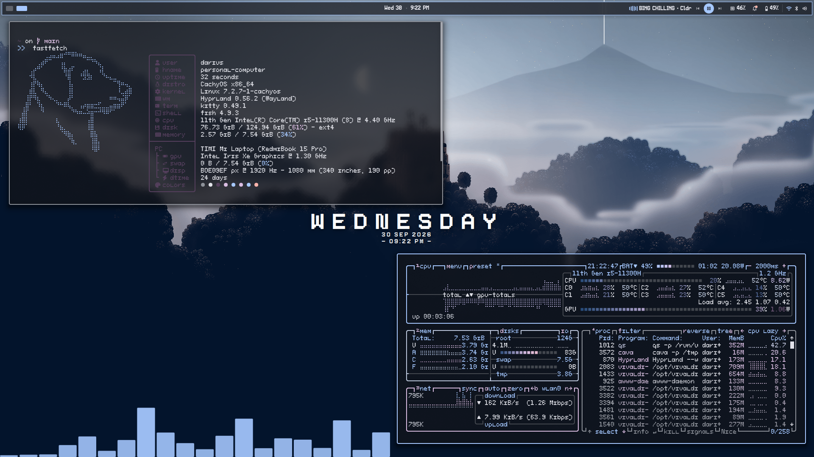

# vissarionn's dotfiles

Dotfiles for a fully pixel art rice I made in like two or so weeks.



## Included Configurations

Custom configs include configs for:
- DankMaterialShell (Since it's built on DMS)
- Rofi (Both an application menu and a power menu)
- Kitty
- Fastfetch
- SDDM (The lock screen, comes with only one theme)

It also comes with a bunch of fonts and wallpapers (both static and animated) you can use.

## Dependencies

- DankMaterialShell (VERY IMPORTANT because the ENTIRE THING depends on it)
- Rofi
- Kitty
- Fastfetch
- skwd-wall-v2
- SDDM

Optional: Niflveil (For minimising windows. Find it here: https://github.com/Mauitron/NiflVeil or simply accept when the setup script asks you if you want to install it)

## Automatic Installation & Setup

Clone the repository to your home directory:

```bash
cd ~
git clone https://github.com/vissarionn/dotfiles.git
cd dotfiles
```

Then run the setup script to install dependencies, copy configs, and install fonts/themes automatically:

```bash
chmod +x setup.sh
./setup.sh
```

> **Note:** I had some issues with Hyprland not loading at all and throwing a black screen instead while I was testing it. If you encounter the same problem, follow the steps below.

**Troubleshooting a black screen:**

Step 1: Open ~/.config/hypr/config/monitors.lua in a text editor of your choice (like nvim or vim)

Step 2: Change the `output` part of the code to match your monitor's name. If you don't know what your monitor is named, open a terminal and enter:

```bash
xrandr
```
It should show up in the output.

Here is an example:

```bash
>>xrandr
Screen 0: minimum 16 x 16, current 1920 x 1080, maximum 32767 x 32767
eDP-1 connected 1920x1080+0+0 (normal left inverted right x axis y axis) 340mm x 190mm
   1920x1080     59.96*+
   1440x1080     59.99
   1400x1050     59.98
   1280x1024     59.89
   1280x960      59.94
   1152x864      59.96
   1024x768      59.92
   800x600       59.86
   640x480       59.38
   320x240       59.29
   1680x1050     59.95
   1440x900      59.89
   1280x800      59.81
   1152x720      59.97
   960x600       59.63
   928x580       59.88
   800x500       59.50
   768x480       59.90
   720x480       59.71
   640x400       59.95
   320x200       58.14
   1600x900      59.95
   1368x768      59.88
   1280x720      59.86
   1024x576      59.90
   864x486       59.92
   720x400       59.27
   640x350       59.28
```
Here, `eDP-1` is my momitor.

After you change it, save and exit. You may also change your resolution and refresh rate.

### Manual Symlinks (Alternative)

If you prefer to manually create symlinks from your home directory pointing to this repository:

```bash
# Link main dotfiles
ln -sf ~/.dotfiles/.zshrc ~/.zshrc
ln -sf ~/.dotfiles/.gitconfig ~/.gitconfig

# Link .rice directory
ln -sF ~/.dotfiles/.rice ~/.rice
```

## Keybindings

| Key combo | Action |
| :--- | :--- |
| `Alt` + `Q` | Open Terminal (Kitty) |
| `Alt` + `Space` | Close Window |
| `Alt` + `F` | Toggle Fullscreen |
| `Alt` + `R` | Toggle Floating Window |
| `Alt` + `S` | Application Menu (Rofi) |
| `Alt` + `X` | Power Menu (Rofi) |
| `Alt` + `1` | Minimise window (Niflveil) |
| `Alt` + `2` | Restore recently minimised window (NiflVeil) |
| `Alt` + `A` | Restore all minimised windows (NiflVeil) |
| `Alt` + `H` | View the rest of keybindings |
| `Ctrl` + `Shift` + `S` | Settings menu (DankMaterialShell) |

> **Note:** You can also change these keybinds in ~/.config/hypr/dms/binds.lua or via the DankMaterialShell settings menu.
